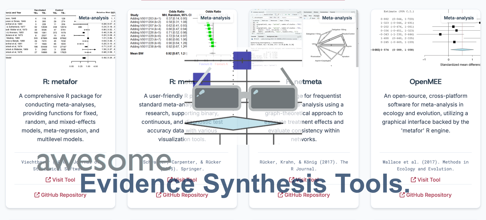
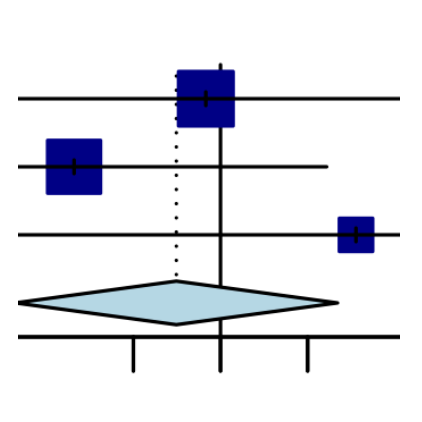

# Awesome Evidence Synthesis Tools 

> Open-source software, libraries, and frameworks designed to support the systematic review, meta-analysis, and evidence synthesis workflow.

This list is curated based on the comprehensive mapping study and directory of open-source software for evidence synthesis. Systematic reviews, meta-analysis, and evidence synthesis are methods for systematically identifying, evaluating, and integrating research evidence across studies.

## Contents

- [Literature Search](#literature-search)
- [Text Mining & NLP](#text-mining--nlp)
- [Screening](#screening)
- [Data Extraction & Cleaning](#data-extraction--cleaning)
- [Risk of Bias Assessment](#risk-of-bias-assessment)
- [Reference Management](#reference-management)
- [Workflow & Automation](#workflow--automation)
- [Visualization & Reporting](#visualization--reporting)
- [Meta-analysis](#meta-analysis)
- [Statistics](#statistics)

## Literature Search

- [CitationChaser](https://estech.shinyapps.io/citationchaser/) - Automates backward and forward citation chasing using Lens.org API to find cited and citing papers for systematic reviews.
- [litsearchr](https://elizagrames.github.io/litsearchr/) - An R package and Shiny app that uses text mining to identify important search terms, builds Boolean strings across databases, and test search performance.
- [OpenAlex](https://openalex.org/) - A fully open catalog of the global research system providing an API to retrieve millions of works, authors, and concepts for searching.
- [R: RISmed](https://cran.r-project.org/web/packages/RISmed/) - R package for accessing data and downloading records from PubMed and NCBI databases programmatically.
- [R: easyPubMed](https://dami82.r-universe.dev/easyPubMed) - A wrapper for the NCBI Entrez API allowing users to query PubMed and parse XML results into R data frames.
- [Systematic Review Accelerator 2](https://github.com/IEBH/SRA2) - The core Systematic Review Accelerator (SRA) application, a key open-source platform for evidence synthesis.
- [TERA Explorer](https://github.com/IEBH/TERA-explorer) - A simple TERA project viewer and editor, confirming "TERA" as an active project name within the suite.
- [SRA Polyglot](https://iebh.github.io/sra-polyglot/) - A tool to convert between different medical database search formats, directly relevant to search strategy development.
- [BioEntrez](https://biopython.org/) - A module within the Biopython library that provides a programmatic interface to the NCBI Entrez utilities for automated searches and data retrieval.
- [Entrez Direct](https://www.ncbi.nlm.nih.gov/books/NBK179288/) - A set of command-line utilities for accessing the NCBI Entrez databases, allowing for powerful, scriptable PubMed searches.
- [Rentrez](https://docs.ropensci.org/rentrez/) - An R package providing an R interface to the NCBI E-utilities API for searching PubMed, downloading records, and fetching linked data programmatically.
- [Carrot2](https://carrot2.org/) - An open-source search results clustering engine that automatically organizes search results into thematic categories to help researchers refine search queries.
- [PyMedTermino](https://pypi.org/project/PyMedTermino/) - A Python library designed to manipulate the MeSH (Medical Subject Headings) thesaurus for biomedical search strategies and programmatic search string creation.
- [Whoosh](https://whoosh.readthedocs.io/) - A fast, pure Python search engine library useful for building custom local search indices of downloaded PDF libraries.
- [Paperfetcher](https://paperfetcher.github.io) - Automates handsearching and citation searching for systematic reviews using Crossref and COCI databases, enabling one-click snowballing and RIS exports.
- [PubMed Search Tester](https://esperr.github.io/pubmed-search-tester/about.html) - A web-based tool designed to help librarians and researchers construct and validate PubMed search queries in real-time.
- [Scholarly](https://scholarly.readthedocs.io/) - A Python library that retrieves data from Google Scholar by scraping citation counts and metadata, serving as a standard open-source method for programmatic access.
- [europepmc](https://docs.ropensci.org/europepmc/) - An R package to retrieve metadata and full text from the Europe PMC database, a crucial resource for accessing biomedical literature and open-access content.
- [pybliometrics](https://pybliometrics.readthedocs.io) - An open-source Python interface for retrieving and analyzing bibliographic data from the Scopus APIs for automated literature retrieval and bibliometric analysis.
- [rcrossref](https://docs.ropensci.org/rcrossref/) - An open-source R client for interacting with the Crossref REST API to retrieve scholarly metadata, DOI records, and citation information.

## Text Mining & NLP

- [PubTator 3.0](https://www.ncbi.nlm.nih.gov/research/pubtator3/) - A web-based semantic annotation system for biomedical literature, automatically recognizing concepts like genes, diseases, and chemicals.
- [BioTextQuest v2.0](https://bioinformatics.med.uoc.gr/shinyapps/app/biotextquest) - An open-source web portal for biomedical literature mining that clusters PubMed search results to facilitate concept discovery and entity association.
- [Kindred](https://kindred.readthedocs.io/en/stable/) - A Python library for supervised relation extraction from biomedical text, identifying structured relationships (e.g., gene-disease) using machine learning.
- [LitLLMs](https://litllm.github.io) - An open-source framework for applying large language models to literature review tasks, including summarization, retrieval, and synthesis.
- [R: syuzhet](https://cran.r-project.org/web/packages/syuzhet/) - An R package designed to extract sentiment and sentiment-derived plot arcs from text using various sentiment dictionaries for narrative analysis.
- [RTextTools](http://www.rtexttools.com) - An R package for automatic text classification that creates machine learning models for supervised learning, useful for screening automation.
- [spacy](https://spacy.io/) - Industrial-strength Natural Language Processing (NLP) library for Python, providing pre-trained models for named entity recognition, part-of-speech tagging, and dependency parsing.
- [R: tidytext](https://cran.r-project.org/web/packages/tidytext/) - An R package for text mining using 'tidy data' principles, allowing seamless integration with the 'tidyverse' ecosystem for sentiment and term analysis.
- [R: quanteda](https://quanteda.io/) - A comprehensive R package for the quantitative analysis of textual data, speeding up the workflow for creating and managing corpora.
- [R: topicmodels](https://cran.r-project.org/web/packages/topicmodels/) - An R package that provides an interface to Latent Dirichlet Allocation (LDA) for identifying latent topics and themes within large document sets.
- [R: snowballC](https://cran.r-project.org/web/packages/SnowballC/) - An R package for text stemming which reduces words to their root form to improve matching during text analysis.
- [R: udpipe](https://bnosac.github.io/udpipe/en/) - An R package for fast text tokenization, parts of speech tagging, lemmatization, and dependency parsing using pre-trained models.
- [scikit-learn](https://scikit-learn.org/) - Python's premier machine learning library, featuring simple and efficient tools for predictive data analysis and mining, widely used to build custom classification models.
- [transformers](https://huggingface.co/docs/transformers/) - A library by Hugging Face providing thousands of pre-trained models for text, image, and audio tasks, enabling use of state-of-the-art NLP models like BERT.
- [Gensim](https://radimrehurek.com/gensim/) - A Python library for topic modeling, document indexing, and similarity retrieval with large corpora, providing efficient algorithms for analyzing textual data.
- [SciSpaCy](https://allenai.github.io/scispacy/) - A Python library containing spaCy models for processing biomedical, scientific, or clinical text, ideal for extraction and NLP tasks.
- [QuickUMLS](https://pypi.org/project/medspacy-quickumls/) - A fast, unsupervised approach for extracting concepts from biomedical text and mapping them to UMLS concepts, significantly faster than MetaMap.
- [MetaNLP](https://cran.r-project.org/package=MetaNLP) - Natural language processing for meta-analysis, processing titles and abstracts for data extraction and synthesis.

## Screening

- [ASReview](https://asreview.ai/) - An open-source machine learning tool for systematic reviews that assists researchers in screening papers interactively and efficiently.
- [ReviewAid](https://reviewaid.github.io) - An open-source AI full text screening & data extraction assistant designed to speed up systematic review process.
- [Abstrackr](https://abstrackr.com) - A free, open-source web application designed to help researchers screen citations for systematic reviews using machine learning.
- [R: revtools](https://cran.r-project.org/web/packages/revtools/) - A toolkit for systematic reviews in R, facilitating article screening via visual inspection and topic modeling of search results.
- [R: metagear](https://cran.r-project.org/web/packages/metagear/) - R package that provides tools for article deduplication, downloading PDFs, and interactive screening.
- [Hypothes.is](https://hypothes.is/) - An open-source layer over the web for annotating documents, web pages, and PDFs collaboratively during the screening process.
- [RobotSearch](https://www.robotreviewer.net/blog/2018/10/2/robotsearch-is-online-apply-our-classifier-to-your-search-results) - A machine learning tool designed to filter out articles that do not describe randomized controlled trials (RCTs) from search results.
- [DenseReviewer](https://densereviewer.ielab.io) - A Python-based tool designed to accelerate the screening phase by using Dense Retrieval models to rank relevant studies and incorporating active learning.
- [Trial2rev](https://pubmed.ncbi.nlm.nih.gov/31984340/) - A system combining machine learning and crowd-sourcing to create a shared space for updating systematic reviews.
- [RefRandomiser](https://refrandomiser.streamlit.app) - A Python-based data splitting tool developed to support double-screening processes in evidence synthesis by randomizing references.
- [rayyanR](https://github.com/befriendabacterium/rayyanR) - An R package designed to process screening decisions exported from the Rayyan systematic review platform, structuring them for analysis and Prisma flow diagrams.

## Data Extraction & Cleaning

- [Tabula](https://tabula.technology/) - A tool for liberating data tables locked inside PDF files, extracting tables into CSV or Excel formats to facilitate data extraction.
- [WebPlotDigitizer (v4)](https://apps.automeris.io/wpd/) - An open-source, semi-automated tool to extract numeric data from plot images, useful for extracting data from graphs for meta-analysis.
- [GROBID](https://grobid.github.io/) - A machine learning library and tool for extracting structured information (bibliographic data, tables, headers) from scientific documents in PDF format.
- [OCRmyPDF](https://ocrmypdf.readthedocs.io/) - A command line tool that adds an OCR text layer to scanned PDF files, making them searchable and selectable for data extraction.
- [Tesseract OCR](https://tesseract-ocr.github.io/) - The most popular open-source Optical Character Recognition (OCR) engine, used to extract text from images and scanned PDFs.
- [Camelot](https://camelot-py.readthedocs.io/) - A Python library that helps you extract tables from PDFs, providing a command line interface and robust PDF table extraction capabilities.
- [PDFPlumber](https://github.com/jsvine/pdfplumber) - A Python library to reliably extract text and tables from PDFs, even those with complex layouts, aiding in data extraction.
- [Nougat](https://github.com/facebookresearch/nougat) - An open-source neural network model that converts scientific PDFs into Markdown, facilitating text and table extraction.
- [R: MICE](https://cran.r-project.org/web/packages/mice/) - Multivariate Imputation by Chained Equations (MICE) is an R package used for handling missing data through multiple imputation in incomplete datasets.
- [ImageJ](https://imagej.net/ij/) - A Java-based image processing program widely used to extract data points from raster plots and images.
- [Engauge Digitizer](https://akhuettel.github.io/engauge-digitizer/) - Open source software for converting image files back to numbers, extracting data from graph images for analysis.
- [Recogito](https://recogito.pelagios.org/) - An open-source web-based tool for collaborative document annotation and text mapping.
- [SciPDF Parser](https://www.piwheels.org/project/scipdf-parser/) - A Python library designed to parse scientific PDFs to extract metadata, sections, references, and tables for custom data extraction pipelines.
- [metaDigitise](https://cran.r-project.org/web/packages/metaDigitise/index.html) - An R package for high-throughput, reproducible extraction of data from published figures to digitize plots efficiently.
- [Science Parse](https://ucrel.github.io/science_parse_py_api/api.html) - A machine learning library (Scala/Java) for parsing scientific papers, extracting metadata, references, and header structures from PDFs.
- [AnyStyle](https://anystyle.io/) - A parser (Ruby-based) that uses machine learning to extract structured citation data from messy text strings, useful for cleaning reference lists.
- [Plot Digitizer](https://plotdigitizer.sourceforge.net/) - A Java-based tool used to digitize scanned plots of functional data to recover numerical data from graphs.
- [SurvdigitizeR](https://pechlilab.shinyapps.io/SurvdigitizeR/) - An R package and Shiny application algorithm for automated survival curve digitization with accuracy comparable to manual methods.
- [Taguette](https://www.taguette.org/) - An open-source qualitative analysis tool that supports code-and-retrieval methods using simple text files for qualitative data extraction.
- [QualCoder](https://qualcoder.wordpress.com) - A fully open-source qualitative analysis tool for text, audio, video, and images, providing advanced coding and analysis features.
- [R: RQDA](https://cran-archive.r-project.org/web/checks/2020/2020-05-20_check_results_RQDA.html) - An R package for Qualitative Data Analysis that assists in managing qualitative data, coding, and analyzing text.
- [CATMA](https://catma.de/) - Computer Assisted Text Markup & Analysis is a Java-based open-source tool for collaborative text analysis and annotation.
- [sysrevdata](https://softloud.github.io/sysrevdata/) - An R package designed to convert systematic review and map databases into human- and machine-readable formats.
- [MSE FINDR](https://apsjournals.apsnet.org/doi/10.1094/PDIS-11-23-2519-SR) - A Shiny R application to estimate Mean Square Error using treatment means and post hoc test results.
- [Auto-STEED](https://journals.plos.org/plosone/article?id=10.1371/journal.pone.0311358) - A data mining tool for automated extraction of experimental parameters and risk of bias items from in vivo publications.
- [LitOrganizer](https://www.sciencedirect.com/science/article/pii/S2352711025001657) - Automates the process of data extraction and organization for scientific literature reviews, running locally as a management tool.
- [prismAId](https://prismaid.review) - An open-source toolkit designed to support systematic literature reviews using generative AI for structured information extraction.
- [ReAct-ExtrAct](https://react-extract.streamlit.app) - An open-source tool for automated, source-grounded data extraction in systematic reviews.

## Risk of Bias Assessment

- [RobotReviewer](https://www.robotreviewer.net) - An open-source system that automates risk-of-bias assessment and data extraction for randomized controlled trials using NLP.
- [Critiplot](https://critiplot.vercel.app) - A specialized open-source tool for generating traffic light plots for MMAT, ROBIS, GRADE, NOS, JBI Case Series/report assessments.
- [robvis](https://www.riskofbias.info/welcome/robvis-visualization-tool) - An R package and web app for generating risk-of-bias assessment plots, supporting RoB2, ROBINS-I, QUADAS-2, and more.
- [NOS-TLPlot](https://nos-tlplot.vercel.app) - Open-source tool designed to visualize Newcastle-Ottawa Scale (NOS) assessments using traffic light plots.
- [psychometric](https://cran.r-project.org/web/packages/psychometric/) - R package for applied psychometric theory, offering functions for reliability analysis, validity, and item analysis.
- [CINeMA](https://cinema.ispm.unibe.ch/) - Software for semiautomated assessment of the confidence in the results of network meta-analysis, guiding users through the evaluation process.

## Reference Management

- [Zotero](https://www.zotero.org/) - Free, open-source reference manager that helps collect, organize, cite, and share research sources.
- [JabRef](https://www.jabref.org/) - Open-source bibliography reference manager. The native file format used is BibTeX, standard for LaTeX.
- [OpenRefine](https://openrefine.org/) - A power tool for working with messy data, cleaning it, transforming it, and extending it with web services.
- [BiblioGlutton](https://biblio-glutton.readthedocs.io) - An open-source browser extension that recommends papers and automatically adds references to your library.
- [Docear](https://www.docear.org/) - An open-source academic literature suite based on mind mapping, helping to organize PDFs and annotations.
- [ZotFile](https://zotfile.com/) - An open-source Zotero plugin to automatically rename and attach PDFs to your references.
- [BibDesk](https://bibdesk.sourceforge.io) - An open-source graphical BibTeX editor and bibliography manager for macOS.
- [BibSonomy](https://www.bibsonomy.org/) - An open-source social bookmarking and publication sharing platform for researchers.
- [Zotero Better BibTeX](https://retorque.re/zotero-better-bibtex/) - A plugin for Zotero that automatically generates BibTeX keys and exports.
- [Papis](https://papis.readthedocs.io/) - A powerful and highly extensible document and bibliography management system / library.
- [Manubot](https://manubot.org/) - Open-source software for creating scholarly manuscripts via YAML citations, generating citations and formats using pandoc/citeproc.
- [Dedupe](https://dedupe.io/) - A Python library for fast, scalable fuzzy matching and deduplication of records (e.g., citations).
- [KBibTeX](https://apps.kde.org/kbibtex/) - A BibTeX editor for the KDE desktop environment providing a comfortable interface to manage bibliographic databases.
- [Wikindx](https://wikindx.sourceforge.io/) - An online bibliographic management and article authoring system designed for single or multi-user collaboration.
- [PredicTER](https://predicter.github.io) - A Shiny app that predicts the time required to conduct systematic reviews and maps to help researchers plan their projects.
- [ASySD](https://camaradesuk.github.io/ASySD/) - A web application designed to de-duplicate large search results from multiple databases for systematic reviews efficiently.
- [HAWC](https://hawcproject.org/) - An open-source content management system used to guarantee transparency in systematic reviews, managing the review process and documentation.

## Workflow & Automation

- [Pandoc](https://pandoc.org/) - A universal document converter that turns files from one markup format into another (e.g., Word to Markdown), useful for document preparation.
- [PDFtk (PDF Toolkit)](https://www.pdflabs.com/tools/pdfltk-the-pdf-toolkit) - A tool for performing everyday tasks on PDF files, such as splitting, merging, and rotating pages, without editing the content.
- [PyPDF2](https://github.com/py-pdf/pypdf2) - A pure-Python library built as a PDF toolkit, capable of extracting document information, splitting, merging, and cropping pages.
- [OSF (Open Science Framework)](https://osf.io/) - An open-source project management tool supporting the full research lifecycle, from preregistration to data sharing and collaboration.
- [R: R Markdown](https://rmarkdown.rstudio.com/) - A framework for creating dynamic documents that turn analysis code into fully reproducible reports for transparent documentation.
- [R: bookdown](https://bookdown.org/) - An R package that allows authors to write books and long-form reports using R Markdown to facilitate comprehensive systematic reviews.
- [Citation.js](https://citation.js.org/) - An open-source JavaScript library for formatting citations in CSL-JSON and converting them to various bibliographic styles.
- [GPT-Researcher](https://gptr.dev/) - An open-source autonomous agent that conducts comprehensive research on any topic by aggregating online sources and producing detailed, cited research reports.
- [Thoth](http://lesse.com.br/tools/thoth/) - A web-based support tool developed to assist with the systematic literature review process, particularly in software engineering.
- [metaverse](https://rmetaverse.github.io) - A meta-project that integrates and expands the number and utility of R functions for systematic review and meta-analysis.
- [EPPI Reviewer](https://eppi.ioe.ac.uk/cms/Default.aspx?tabid=2914) - A web-based software for managing all stages of the systematic review process, including searching, screening, and data extraction.
- [SyRF](https://syrf.org.uk/) - The CAMARADES Systematic Review Facility (SyRF) is an open-source platform designed specifically for preclinical systematic reviews.
- [Prisma 2020 (Flow Diagram)](https://estech.shinyapps.io/PRISMA_flowdiagram_latest/) - The official Prisma 2020 Flow Diagram Generator (Shiny App & R package) automatically creates a correctly formatted Prisma flow diagram.
- [ROSES flowchart](https://estech.shinyapps.io/roses_flowchart/) - An R package and Shiny app for creating flow diagrams compliant with the ROSES (Reporting Standards for Systematic Evidence Syntheses) guidelines.
- [PROMPTHEUS](https://github.com/joaopftorres/PROMPTHEUS) - A human-centered pipeline designed to streamline Systematic Literature Reviews using Large Language Models, operating locally to support researchers.
- [LLAssist](https://arxiv.org/abs/2407.13993) - Provides simple tools for automating literature reviews by leveraging Large Language Models and Natural Language Processing to extract information and evaluate relevance.
- [ProfOlaf](https://arxiv.org/abs/2510.26750v2) - An open-source semi-automated tool designed to support systematic literature reviews by assisting in study selection and organization. 
- [LatteReview](https://pouriarouzrokh.github.io/LatteReview/) - An open-source multi-agent framework designed to automate systematic review workflows using large language models.
- [EvidenceSynthesis](https://ohdsi.github.io/EvidenceSynthesis/) - Contains routines for combining causal effect estimates and study diagnostics across multiple data sites in a distributed study using meta-analysis.

## Visualization & Reporting

- [VOSviewer](https://www.vosviewer.com/) - A software tool for constructing and visualizing bibliometric networks, useful for evidence mapping and co-citation analysis.
- [RawGraphs](https://rawgraphs.io/) - An open-source platform built to create custom vector-based visualizations on top of the D3.js library without coding.
- [EviAtlas](https://estech.shinyapps.io/eviatlas/) - A tool for creating systematic map visualizations to organize and display the distribution of evidence in a specific field.
- [bibliometrix](http://www.bibliometrix.org/) - A comprehensive tool for quantitative research in bibliometrics and scientometrics, providing all the main tools for bibliometric analysis.
- [flowchart](https://bruigtp.github.io/flowchart/) - An open-source R package designed to create flow diagrams, particularly useful for visualizing study selection processes such as PRISMA diagrams in systematic reviews. 
- [Gephi](https://gephi.org/) - An open-source platform for visualizing and exploring large networks and graphs, widely used for network analysis and science mapping.
- [Cytoscape](https://cytoscape.org/) - An open source software platform for visualizing complex networks and integrating these with any type of attribute data.
- [QGIS](https://www.qgis.org/) - A free and open-source Geographic Information System (GIS) that supports creating, editing, visualizing, and analyzing geospatial information.
- [R: wordcloud](https://cran.r-project.org/web/packages/wordcloud/) - An R package that provides a simple interface for creating word clouds for visualizing text data frequency.
- [R: ggraph](https://cran.r-project.org/web/packages/ggraph/) - An R package extending the grammar of graphics to graph data, built on top of ggplot2 for network visualizations.
- [R: ggplot2](https://cran.r-project.org/web/packages/ggplot2/) - The foundational R package for declaratively creating graphics, widely used to produce forest plots and funnel plots.
- [R: patchwork](https://patchwork.data-imaginist.com/) - An R package that provides a simple syntax for combining separate ggplot2 graphics into the same figure for multi-panel visualizations.
- [R: cowplot](https://cran.r-project.org/web/packages/cowplot/) - An R package that provides themes and utilities to create publication-ready figures using ggplot2 and combine multiple plots.
- [Graphviz](https://graphviz.org/) - Open-source graph visualization software that represents structural information as diagrams of abstract graphs and networks.
- [Sci2](https://sci2.cns.iu.edu/) - A modular toolset designed for the study of science, enabling temporal, geospatial, and topological analyses of scholarly datasets.
- [R: forestplot](https://cran.r-project.org/web/packages/forestplot/) - An R package specifically designed for creating forest plots, which are standard visualizations in meta-analysis.
- [MAvis](http://kylehamilton.net/shiny/MAVIS/) - An interactive Shiny application designed for visualizing meta-analysis data, including forest plots, funnel plots, and L'Abbe plots.
- [metaviz](https://cloud.r-project.org/web/packages/metaviz/vignettes/metaviz.html) - An R package for creating flexible visualizations for meta-analytic data, including rainforest plots and subgroup visualizations.
- [ShinyMeta](https://rstudio.github.io/shinymeta/) - A Shiny web application that provides a graphical user interface for performing meta-analysis and meta-regression using the 'metafor' package.
- [Kilim Plot / Vitruvian Plot](https://cinema.ispm.unibe.ch/shinies/kilim/) - A graphical tool for visualizing network meta-analysis results for multiple outcomes, compactly summarizing absolute treatment effects.
- [MetaAnalyser](https://cran.r-project.org/package=MetaAnalyser) - An interactive application to visualize meta-analysis data as a physical weighing machine.
- [viscomp](https://cran.r-project.org/package=viscomp) - Visualization tools for exploring multi-component interventions in network meta-analysis.
- [nmaplateplot](https://cran.r-project.org/package=nmaplateplot) - The plate plot for network meta-analysis, a graphical display of treatment effects.
- [NMAforest](https://cran.r-project.org/web/packages/NMAforest/) - Provides customized forest plots for network meta-analysis, visualizing direct, indirect, and NMA effects.
- [Open Knowledge Maps](https://openknowledgemaps.org/) - An open-source visual discovery tool that creates a "knowledge map" of a research topic by clustering top papers.
- [CorTexT Manager](https://www.cortext.net) - A platform for analyzing and visualizing large textual corpora, particularly strong in bibliometric analysis and network visualization.

## Meta-analysis

- [R: EValue](https://cran.r-project.org/web/packages/EValue/) - R package to calculate E-values, metrics to assess robustness to unmeasured confounding in meta-analyses.
- [psychmeta](https://psychmeta.com) - R package for conducting psychometric meta-analyses, providing tools for artifact correction, data cleaning, and aggregation.
- [R: metafor](https://www.metafor-project.org/) - A comprehensive R package for conducting meta-analyses, providing functions for fixed, random, and mixed-effects models.
- [R: meta](https://cran.r-project.org/web/packages/meta/) - A user-friendly R package for standard meta-analysis in clinical research, supporting binary, continuous, and diagnostic test accuracy data.
- [R: netmeta](https://cran.r-project.org/web/packages/netmeta/) - An R package for frequentist network meta-analysis using a graph-theoretical approach to estimate treatment effects.
- [OpenMEE](https://besjournals.onlinelibrary.wiley.com/doi/10.1111/2041-210X.12708) - An open-source, cross-platform software for meta-analysis in ecology and evolution, utilizing a graphical interface backed by 'metafor'.
- [OpenMetaAnalyst](https://www.jstatsoft.org/article/view/v049i05) - A user-friendly, open-source software for performing meta-analysis and meta-regression using a graphical interface.
- [JASP](https://jasp-stats.org/) - Free and open-source software for statistical analysis, featuring a graphical interface with a dedicated module for conducting meta-analysis.
- [OpenEpi](https://www.openepi.com/) - A web-based, open-source set of epidemiologic calculators for statistics in descriptive and analytic studies, useful for data extraction and statistical verification.
- [PyMC](https://www.pymc.io/) - A Python library for Bayesian statistical modeling and probabilistic machine learning focusing on Markov chain Monte Carlo (MCMC) algorithms.
- [JAGS](https://mcmc-jags.sourceforge.io) - A program for analysis of Bayesian hierarchical models using Markov Chain Monte Carlo (MCMC) simulation.
- [Stan](https://mc-stan.org/) - A state-of-the-art platform for statistical modeling and high-performance computation using Hamiltonian Monte Carlo (HMC).
- [R: meta4diag](https://cran.r-project.org/web/packages/meta4diag/) - An R package specifically designed for the Bayesian meta-analysis of diagnostic test accuracy studies handling complex data structures.
- [R: mada](https://cran.r-project.org/web/packages/mada/) - An R package that provides functions for the meta-analysis of diagnostic accuracy data, supporting various statistical models and visualization.
- [R: bmeta](https://cran.r-project.org/src/contrib/Archive/bmeta/) - An R package designed for conducting Bayesian meta-analysis and meta-regression using JAGS with a flexible framework.
- [R: MAc](https://rdrr.io/cran/MAc/#:~:text=This%20is%20an%20integrated%20meta%2Danalysis%20package%20for,features%20of%20this%20package%20is%20in%20its) - An R package for the meta-analysis of correlation matrices, particularly useful in psychometrics and social sciences.
- [R: metaRNAseq](https://cran.r-project.org/web/packages/metaRNASeq/index.html) - An R package for the meta-analysis of RNA-Seq count data, providing standardization for cross-study comparison of differential gene expression.
- [R: metaMA](https://cran.r-project.org/web/packages/metaMA/) - An R package dedicated to the meta-analysis of microarray data, combining p-values from multiple studies to identify differentially expressed genes.
- [R: metaSEM](https://cran.r-project.org/web/packages/metaSEM/) - An R package for conducting meta-analytic structural equation modeling (MASEM) to synthesize correlation or covariance matrices across studies.
- [R: gemtc](https://cran.r-project.org/web/packages/gemtc/) - An R package for network meta-analysis using a Bayesian graphical model framework, primarily interfacing with JAGS.
- [R: multinma](https://cran.r-project.org/web/packages/multinma/) - An R package for network meta-analysis of randomized trials and observational studies, utilizing Stan for Bayesian inference.
- [R: dosresmeta](https://cran.r-project.org/web/packages/dosresmeta/) - An R package for performing dose-response meta-analysis of aggregated data using a one-stage approach to model non-linear relationships.
- [R: MetaForest](https://cran.r-project.org/web/packages/metaforest/index.html) - An R package that applies Random Forests to meta-analytic data to explore heterogeneity and model complex, non-linear relationships.
- [R: Bayesmeta](https://cran.r-project.org/web/packages/bayesmeta/) - An R package for conducting Bayesian random-effects meta-analysis with a focus on robust parameter estimation and predictive inference.
- [R: metapower](https://cran.r-project.org/web/packages/metapower/) - An R package for power analysis in meta-analysis, helping researchers calculate the required number of studies or sample size to detect an effect.
- [R: metaumbrella](https://metaumbrella.org) - An R package specifically designed to perform "Umbrella Reviews," which are systematic reviews of multiple meta-analyses.
- [R: pimeta](https://cran.r-project.org/web/packages/pimeta/) - An R package for calculating prediction intervals in meta-analysis, offering insights into the range of true effects in future studies.
- [R: metaplus](https://cran.r-project.org/web/packages/metaplus/) - An R package for random-effects meta-analysis that uses heavy-tailed distributions, such as the t-distribution, to handle outliers effectively.
- [R: robustmeta](https://cran.r-project.org/web/packages/robustmeta/) - An R package that performs robust statistical inference in meta-analysis using methods like the RD and REMLC estimators to protect against violations.
- [R: metamedian](https://cran.r-project.org/web/packages/metamedian/) - An R package for performing median-based meta-analysis, providing robust alternatives to mean-based aggregation methods.
- [R: metaLik](https://cran.r-project.org/web/packages/metaLik/) - An R package that provides likelihood-based methods for conducting meta-analysis, particularly useful for diagnostic accuracy studies.
- [R: brms](https://cran.r-project.org/web/packages/brms/) - An interface to Stan for Bayesian regression models that allows users to fit complex multilevel models using R formula syntax.
- [R: R2OpenBUGS](https://cran.r-project.org/web/packages/R2OpenBUGS/) - An R package that acts as an interface to the OpenBUGS software, enabling users to run Bayesian models directly from the R console.
- [BUGSnet](https://bugsnetsoftware.github.io) - A web-based platform for conducting Network Meta-Analysis (NMA) using OpenBUGS, designed to be user-friendly for researchers without programming expertise.
- [R: robumeta](https://cran.r-project.org/web/packages/robumeta/) - An R package for conducting robust variance estimation (RVE) in meta-analysis, which is essential for handling dependent effect sizes.
- [R: dmetar](https://dmetar.protectlab.org) - A comprehensive R package to assist in conducting meta-analyses, providing helper functions for data preparation, effect size calculation, and bias assessment.
- [compute.es](https://cran.r-project.org/web/packages/compute.es/) - R package for computing effect sizes (d, g, r, log odds ratio) and their variances from various test statistics.
- [R: clubSandwich](https://cran.r-project.org/web/packages/clubSandwich/) - An R package providing cluster-robust variance estimators for models involving dependent effect sizes, such as multilevel or network meta-analysis.
- [PSPP](https://www.gnu.org/software/pspp/) - A free, open-source replacement for the proprietary program SPSS, offering a similar interface and statistical capabilities.
- [Gretl](https://gretl.sourceforge.io/) - GNU Regression, Econometrics and Time-series Library is an open-source package for econometric analysis useful for complex statistical modeling.
- [MetaInsight](https://crsu.shinyapps.io/MetaInsight/) - A web-based tool that conducts network meta-analysis (NMA) via the web, providing an intuitive interface and interactive visualizations.
- [PyMARE](https://pymare.readthedocs.io/) - A Python library designed to perform meta-analysis tasks, including combining effect measures, heterogeneity testing, and generating forest plots.
- [Jamovi](https://www.jamovi.org/) - A free, open-source statistical spreadsheet designed to be easy to use, including modules for meta-analysis.
- [Meta-CART](https://cran.r-project.org/web/packages/metacart/metacart.pdf) - An R package and tool to identify interactions between moderators in meta-analysis using Classification and Regression Trees (CART).
- [MetaWin](https://www.metawinsoft.com/) - Statistical software package designed for conducting meta-analysis and resampling statistics in ecology and evolutionary biology.
- [Meta-DiSc](http://www.metadisc.es/) - A free software tool used for the meta-analysis of diagnostic test accuracy studies, allowing users to perform statistical analyses and visualize results.
- [MetaDTA](https://crsu-metadta.le.ac.uk/MetaDTA/) - A web-based interactive tool for performing meta-analysis of diagnostic test accuracy studies that simplifies the implementation of complex bivariate hierarchical models.
- [DiagMeta](https://cran.r-project.org/web/packages/diagmeta/) - An R package used for the meta-analysis of diagnostic accuracy studies where multiple thresholds are reported, estimating the summary ROC curve.
- [HSROC](https://cran.r-project.org/src/contrib/Archive/HSROC/) - An R package that implements the Hierarchical Summary ROC model for diagnostic test accuracy meta-analysis within a Bayesian framework.
- [Metatron](https://cran.r-project.org/src/contrib/Archive/Metatron/) - An R package for the meta-analysis of classification data that corrects for the bias of an imperfect reference standard.
- [bamdit](https://cran.r-project.org/package=bamdit) - An R package for Bayesian meta-analysis of diagnostic test data that simplifies the implementation of hierarchical models using JAGS.
- [pcnetmeta](https://CRAN.R-project.org/package=pcnetmeta) - An R package that performs arm-based network meta-analysis using Bayesian hierarchical models via JAGS, supporting binary, continuous, and count outcomes.
- [mmeta](https://CRAN.R-project.org/package=mmeta) - An R package for multivariate meta-analysis of 2×2 tables using Bayesian exact posterior inference, supporting correlated risks within studies.
- [bspmma](https://CRAN.R-project.org/package=bspmma) - An R package for Bayesian semiparametric random-effects meta-analysis using Dirichlet process priors to support non-normal effect distributions.
- [RIMeta](https://cers.shinyapps.io/RIMeta/) - An R Shiny application for estimating reference intervals from a meta-analysis using aggregate summary statistics, implementing fixed effects and random effects models.
- [MA-cont](https://katerina-pap.shinyapps.io/MA-cont-prepostES/) - An R Shiny application for meta-analysis of continuous outcomes with pre- and post-intervention measurements, supporting standard aggregate-data approaches.
- [MBNMAdose](https://CRAN.R-project.org/package=MBNMAdose) - An R package for Model-Based Network Meta-Analysis (MBNMA) that integrates complex dose-response information into a single cohesive framework.
- [metap](https://cran.r-project.org/package=metap) - Functions for combining p-values (significance values) from studies, providing methods for meta-analysis when effect sizes are not available.
- [RTSA](https://cran.r-project.org/package=RTSA) - Trial Sequential Analysis for error control, allowing for the calculation of group sequential designs for meta-analysis to control for type I and II errors.
- [mixmeta](https://cran.r-project.org/package=mixmeta) - An extended mixed-effects framework for multivariate and longitudinal meta-analysis and meta-regression, handling complex dependency structures.
- [rnmamod](https://cran.r-project.org/package=rnmamod) - Bayesian network meta-analysis with missing data, running models using JAGS and checking response consistency.
- [baggr](https://cran.r-project.org/package=baggr) - Bayesian meta-analysis of aggregated data using Stan, supporting various models including hierarchical and potential outcomes.
- [esc](https://cran.r-project.org/package=esc) - Effect size computation for meta-analysis, calculating a wide range of effect sizes from various test statistics and data formats.
- [metaBMA](https://cran.r-project.org/package=metaBMA) - Bayesian model averaging for random and fixed effects meta-analysis, allowing for the comparison of different meta-analytic models.
- [metasens](https://cran.r-project.org/package=metasens) - Statistical methods for sensitivity analysis in meta-analysis, evaluating how sensitive results are to publication bias.
- [bipd](https://cran.r-project.org/package=bipd) - Bayesian Individual Patient Data Meta-Analysis using 'JAGS', facilitating the synthesis of IPD in a Bayesian framework.
- [MetaStan](https://cran.r-project.org/package=MetaStan) - Bayesian meta-analysis via 'Stan', fitting several models including binomial-normal hierarchical models.
- [MAd](https://cran.r-project.org/package=MAd) - Meta-analysis with mean differences, conducting meta-analysis using standardized mean differences and assuming correlated effect sizes.
- [Manalyzer](https://black-yt.github.io/meta-analysis-page/) - An open-source end-to-end automated meta-analysis system that uses a multi-agent architecture to conduct statistical synthesis.
- [CaMeA](https://cran.r-project.org/package=CaMeA) - Causal meta-analysis for aggregated data, implementing aggregation formulas and inference methods proposed by Berenfeld et al.
- [mvtmeta](https://cran.r-project.org/package=mvtmeta) - Multivariate meta-analysis, designed for modeling multiple outcomes simultaneously using multivariate normal distributions.
- [mc.heterogeneity](https://cran.r-project.org/package=mc.heterogeneity) - A Monte Carlo based test for between-study heterogeneity in meta-analysis of standardized mean differences.
- [metapro](https://cran.r-project.org/package=metapro) - An R package that implements powerful p-value combination methods to detect incomplete association in meta-analyses.
- [metarep](https://cran.r-project.org/package=metarep) - Replicability-analysis tools for meta-analysis, assessing the replicability of findings.
- [metaquant](https://cran.r-project.org/package=metaquant) - Meta-analysis of quantiles and functions thereof using generalized linear distributions.
- [heterometa](https://cran.r-project.org/package=heterometa) - Convert various meta-analysis heterogeneity measures, facilitating the comparison and reporting of heterogeneity.
- [getspres](https://magosil86.github.io/getspres/) - SPRE statistics for exploring heterogeneity in meta-analysis, calculating precision-weighted residuals.
- [rema](https://cran.r-project.org/package=rema) - Rare event meta-analysis, implementing a permutation-based approach to handle rare event data.
- [vcmeta](https://cran.r-project.org/package=vcmeta) - Varying coefficient meta-analysis methods, not assuming effect size homogeneity.
- [crossnma](https://cran.r-project.org/package=crossnma) - Cross-design & cross-format network meta-analysis, synthesizing evidence from randomized and non-randomized studies.
- [metapack](https://cran.r-project.org/src/contrib/Archive/metapack/) - Bayesian meta-analysis and network meta-analysis with a unified formula interface.
- [nmarank](https://cran.r-project.org/package=nmarank) - Complex hierarchy questions in network meta-analysis, providing treatment rankings.
- [CBnetworkMA](https://cran.r-project.org/package=CBnetworkMA) - Contrast-based Bayesian network meta-analysis, fitting NMA models using a contrast-based approach.
- [pema](https://cjvanlissa.github.io/pema/) - Penalized meta-analysis, using penalization techniques to select moderators in meta-regression models.
- [altmeta](https://cran.r-project.org/package=altmeta) - Alternative meta-analysis methods, including bivariate generalized linear mixed models.
- [boutliers](https://cran.r-project.org/web/packages/boutliers/boutliers.pdf) - Outlier detection and influence diagnostics for meta-analysis.
- [metagroup](https://cran.r-project.org/web/packages/metagroup/metagroup.pdf) - Meaningful grouping of studies in meta-analysis, performing subgroup analysis.
- [selectMeta](https://cran.r-project.org/package=selectMeta) - Estimation of weight functions in meta-analysis to account for publication bias.
- [nmaINLA](https://cran.r-project.org/package=nmaINLA) - Network meta-analysis using integrated nested Laplace approximations for design-by-treatment interaction models.
- [POMADE](https://cran.r-project.org/package=POMADE) - Power for meta-analysis of dependent effects, conducting power analysis for meta-analysis with dependent effect sizes.
- [publipha](https://cran.r-project.org/package=publipha) - Bayesian meta-analysis with publication bias, using selection models to adjust for bias.
- [OssaNMA](https://cran.r-project.org/package=OssaNMA) - Optimal sample size and allocation with a network meta-analysis to optimize the power of new trials.
- [metabup](https://cran.r-project.org/package=metabup) - Bayesian meta-analysis using basic uncertain priors, utilizing basic uncertain pooling methods.
- [rankinma](https://cran.r-project.org/package=rankinma) - Rank in network meta-analysis, gathering and plotting treatment ranking metrics.
- [RBesT](https://cran.r-project.org/package=RBesT) - R Bayesian evidence synthesis tools, facilitating the derivation of robust priors and meta-analyses.
- [detectnorm](https://cran.r-project.org/package=detectnorm) - Detect non-normality in meta-analysis without raw data, assessing distributional assumptions.
- [multibiasmeta](https://cran.r-project.org/package=multibiasmeta) - Meta-analysis for within-study and/or across-study biases, providing sensitivity analysis for interactive effects.
- [getmstatistic](https://magosil86.github.io/getmstatistic/) - SPRE statistics for exploring heterogeneity in meta-analysis, quantifying systematic heterogeneity patterns.
- [MBNMAtime](https://hugaped.github.io/MBNMAtime/) - Run time-course model-based network meta-analysis for longitudinal data, modeling time-course relationships with multiple treatments.
- [tracenma](https://loukiaspin.github.io/tracenma/) - Tools to trace network meta-analysis results across systematic reviews to develop transitivity methodology.
- [metasplines](https://cran.r-project.org/package=metasplines) - Pool meta-analysis estimates and estimates from a regression model using splines to combine literature-based and individual participant data.
- [metagam](https://lifebrain.github.io/metagam/) - Meta-analysis of generalized additive models, allowing for the pooling of non-linear trends.
- [metansue](https://cran.r-project.org/package=metansue) - Meta-analysis of studies with non-statistically significant unreported effects, using multiple imputation.
- [RoBMA](https://fbartos.github.io/RoBMA/) - Robust Bayesian meta-analysis using model-averaging to adjust for publication bias.
- [WMAP](https://cran.r-project.org/package=WMAP) - Weighted meta-analysis with pseudo-populations, using integrative weighting approaches.
- [HCT](https://cran.r-project.org/package=HCT) - Calculates significance criteria and power for a new study based on meta-analysis.
- [CRTSize](https://cran.r-project.org/package=CRTSize) - Sample size estimation functions for cluster randomized trials, incorporating meta-analysis variance reduction.
- [MCMCglmm](https://jarrodhadfield.github.io/MCMCglmm/) - MCMC generalized linear mixed models, capable of conducting meta-analysis using Bayesian methods for complex dependency structures.
- [iSFun](https://cran.r-project.org/package=iSFun) - Inclusive summary function tools for meta-analysis, providing integrative dimension reduction analysis.
- [metapsyTools](https://tools.metapsy.org) - Provides tools for preparing and analyzing meta-analytic datasets from the Metapsy psychotherapy databases, supporting effect size calculation and automated reporting.

## Statistics

- [statcheck](https://cran.r-project.org/web/packages/statcheck/index.html) - An R package that extracts statistical results from text and checks whether reported p-values are consistent with test statistics and degrees of freedom.
- [ArviZ](https://python.arviz.org/) - A Python library for exploratory analysis of Bayesian models, providing backend-agnostic plotting and diagnostics for Bayesian meta-analyses.
- [metacp](https://link.springer.com/article/10.1186/s12859-025-06126-z) - A versatile software package that implements statistical methods for the combination of both independent p-values and dependent p-values.
- [meta-maive](https://cran.r-project.org/package=MAIVE) - Meta-analysis instrumental variable estimator, addressing spurious precision in meta-analysis of observational research.
- [artma](https://cran.r-project.org/package=artma) - Automatic replication tools for meta-analysis, facilitating the reproduction of meta-analytic findings.
- [dmetatools](https://cran.r-project.org/package=dmetatools) - Computational tools for meta-analysis of diagnostic test accuracy studies, handling non-standard metrics.
- [wildmeta](https://cran.r-project.org/package=wildmeta) - Cluster wild bootstrapping for meta-analysis, providing hypothesis testing methods for dependent effect sizes.
- [mars](https://cran.r-project.org/package=mars) - Meta analysis and research synthesis tools for univariate and multivariate meta-analysis.
- [PINMA](https://cran.r-project.org/package=PINMA) - Improved methods to construct prediction intervals for network meta-analysis.
- [NMADTA](https://cran.r-project.org/package=NMADTA) - Network meta-analysis of multiple diagnostic test accuracy studies (1-5 tests) with missing data.
- [coefa](https://cran.r-project.org/package=coefa) - Meta analysis of factor analysis based on co-occurrence matrices.
- [appraise](https://cran.r-project.org/package=appraise) - Bias-aware evidence synthesis in systematic reviews, implementing a bias-aware framework.

## Footnotes

### Project Links 
- **Web Directory:** [evidencesynthesis-tools.github.io](https://evidencesynthesis-tools.github.io)
- **Source Repo:** [evidencesynthesis-tools/evidencesynthesis-tools.github.io](https://github.com/evidencesynthesis-tools/evidencesynthesis-tools.github.io)
- **Research Paper:** [Mapping The Open-Source Landscape (Preprint)](https://osf.io/preprints/metaarxiv/7uskw_v1)

### Criteria & Policies
**Inclusion Criteria:** Tools must use a recognized open-source license (e.g., MIT, GPL), have a public code repository, be non-proprietary, be reusable/extensible, and be relevant to evidence synthesis.

**External API Policy:** Tools interacting with external APIs are included if they use an OSI-approved license, have public code, use external services only for data access/integration, and do not rely on hidden proprietary logic.

### Contributing
Contributions are welcome! Please see [CONTRIBUTING.md](CONTRIBUTING.md) for details on how to suggest additions or changes.